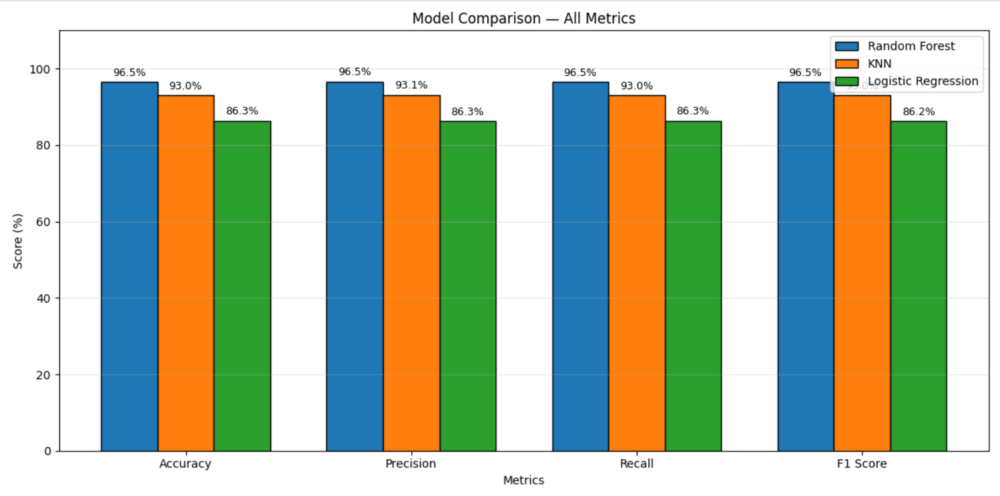
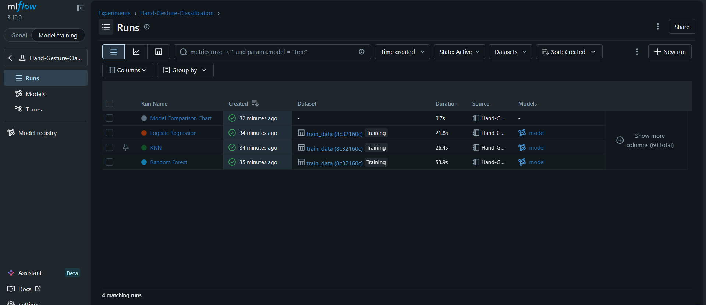
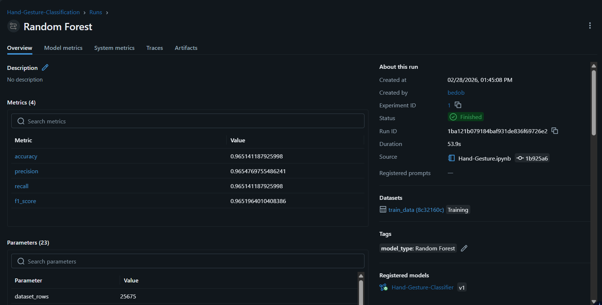
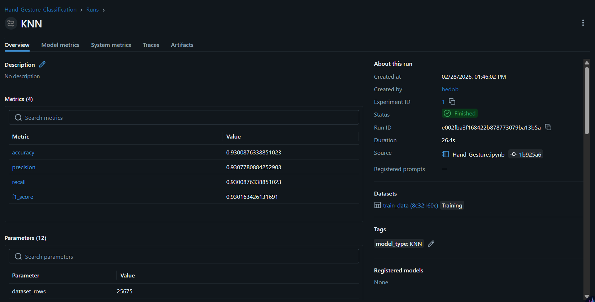
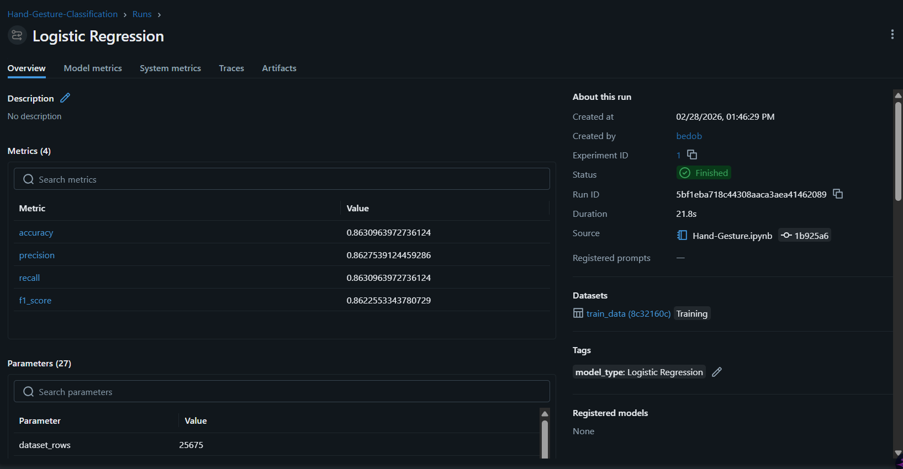
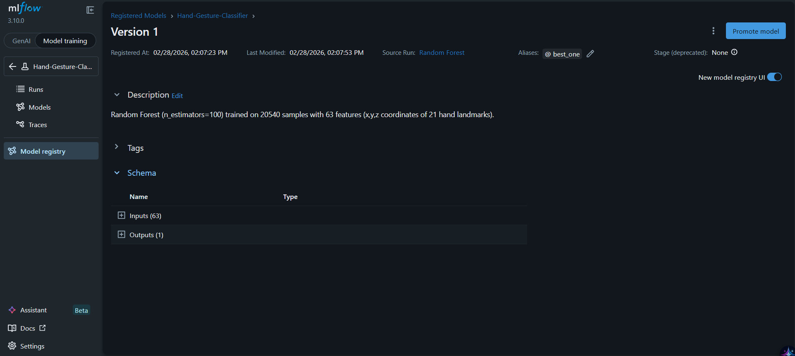

# Hand Gesture Classification

A machine learning project that classifies **18 different hand gestures** using hand landmark coordinates extracted with **MediaPipe**. Includes model training, evaluation, MLflow experiment tracking, model registry, and real-time video inference.

---

## Table of Contents

- [Overview](#overview)
- [Dataset](#dataset)
- [Hand Gestures](#hand-gestures)
- [Project Structure](#project-structure)
- [Installation](#installation)
- [Usage](#usage)
- [Model Training & Results](#model-training--results)
- [MLflow Experiment Tracking](#mlflow-experiment-tracking)
- [MLflow Model Registry](#mlflow-model-registry)
- [Model Selection Decision](#model-selection-decision)
- [Video Inference](#video-inference)
- [Technologies Used](#technologies-used)

---

## Overview

This project uses **21 hand landmarks** (x, y, z coordinates) detected by MediaPipe to classify hand gestures.

**Pipeline:**
1. Extract hand landmarks from images using MediaPipe
2. Normalize landmarks (center on wrist, scale by middle finger)
3. Train multiple classifiers (Random Forest, KNN, Logistic Regression)
4. Track experiments with MLflow
5. Register best model in MLflow Model Registry
6. Run real-time gesture recognition on video

---

## Dataset

- **Samples:** 25,675
- **Features:** 63 (x, y, z for 21 landmarks)
- **Classes:** 18 gesture types
- **File:** `hand_landmarks_data.csv`

---

## Hand Gestures

| | | |
|---|---|---|
| call | dislike | fist |
| four | like | mute |
| ok | one | palm |
| peace | peace_inverted | rock |
| stop | stop_inverted | three |
| three2 | two_up | two_up_inverted |

---

## Project Structure

```
Hand Gesture Classification/
├── Hand-Gesture.ipynb          # Main notebook
├── mlflow_utils.py             # MLflow helper functions
├── hand_landmarks_data.csv     # Dataset
├── best_model.pkl              # Saved best model
├── label_encoder.pkl           # Saved label encoder
├── hand_landmarker.task        # MediaPipe model
├── mlflow.db                   # MLflow database
├── mlruns/                     # MLflow artifacts
├── screenshots/                # Documentation screenshots
└── README.md
```

---

## Installation

```bash
git clone https://github.com/<your-username>/Hand-Gesture-Classification.git
cd Hand-Gesture-Classification
py -3.12 -m venv venv
.\venv\Scripts\Activate.ps1
pip install scikit-learn pandas numpy matplotlib seaborn mediapipe opencv-python joblib scipy mlflow
```

---

## Usage

```bash
# Run notebook
jupyter notebook Hand-Gesture.ipynb

# Launch MLflow UI
mlflow ui
# Open http://127.0.0.1:5000
```

---

## Model Training & Results

Three models were trained and evaluated:

| Model | Accuracy | Precision | Recall | F1-Score |
|-------|----------|-----------|--------|----------|
| **Random Forest** | **96.51%** | **96.55%** | **96.51%** | **96.52%** |
| KNN | 93.01% | 93.08% | 93.01% | 93.02% |
| Logistic Regression | 86.31% | 86.28% | 86.31% | 86.23% |

### Model Comparison Chart



---

## MLflow Experiment Tracking

All experiments are tracked using MLflow under the experiment name **`Hand-Gesture-Classification`**.

Each run logs:
- Dataset info (rows, features, number of classes)
- Model hyperparameters
- Metrics (accuracy, precision, recall, F1-score)
- Trained model artifact with input/output signature
- Classification report
- Confusion matrix
- Comparison chart

### Experiment Runs

All 4 runs (3 models + comparison chart) tracked in MLflow:



### Random Forest Run — Accuracy: 96.51%



### KNN Run — Accuracy: 93.01%



### Logistic Regression Run — Accuracy: 86.31%



---

## MLflow Model Registry

The best model (Random Forest) is registered in the MLflow Model Registry:

- **Model Name:** `Hand-Gesture-Classifier`
- **Version:** 1
- **Alias:** `best_one`
- **Source Run:** Random Forest
- **Inputs:** 63 features
- **Outputs:** 1 (predicted class)



### Load from Registry

```python
import mlflow
model = mlflow.sklearn.load_model("models:/Hand-Gesture-Classifier@best_one")
```

---

## Model Selection Decision

**Random Forest** was selected as the best model because:

- **Highest accuracy** across all 4 metrics (96.51% accuracy, 96.55% precision, 96.51% recall, 96.52% F1-score)
- **Best generalization** — performs consistently well across all 18 gesture classes
- **No feature scaling required** — unlike Logistic Regression which needs StandardScaler
- **Handles non-linear relationships** between hand landmark coordinates naturally
- **Robust to outliers** in landmark detection from MediaPipe
- **KNN** (93.01%) was the second best but slower at inference due to distance computation on all training samples
- **Logistic Regression** (86.31%) struggled with classes like `peace` (59% recall) and `two_up` (73% recall) due to linear decision boundaries

---

## Video Inference

Real-time gesture recognition pipeline:
1. Detect hand landmarks using MediaPipe HandLandmarker
2. Normalize landmarks (center on wrist, scale by middle finger)
3. Predict gesture using the best model (Random Forest)
4. Stabilize prediction with a sliding window (size=15)
5. Draw skeleton and label on each frame
6. Save output video

---

## Technologies Used

- **Python 3.12**
- **scikit-learn** — Random Forest, KNN, Logistic Regression
- **MediaPipe** — Hand landmark detection
- **OpenCV** — Video processing
- **MLflow** — Experiment tracking & Model Registry
- **Pandas / NumPy** — Data manipulation
- **Matplotlib / Seaborn** — Visualization
